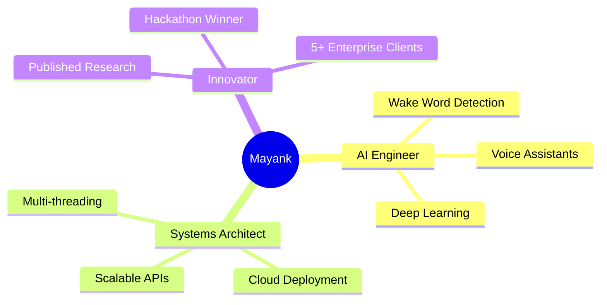

<div align="center">

<!-- Dynamic Header with Wave Animation -->


<!-- Animated Typing Effect -->
[](https://git.io/typing-svg)

<!-- Animated Badge Row -->
<p>
  
  
  
  
</p>

<!-- Social Links with Hover Effect -->
<p>
  <a href="https://linkedin.com/in/mayank-mb">
    
  </a>
  <a href="mailto:mayankbhushan26@gmail.com">
    
  </a>
  <a href="https://github.com/MB-Mayank">
    
  </a>
</p>

<!-- Profile Views Counter with Animation -->


</div>

---

## 🎯 Quick Highlights

<div align="center">



</div>

---

## 🚀 About Me


```python
class MayankBhushan:
    def __init__(self):
        self.username = "MB-Mayank"
        self.location = "Bhubaneswar, India 🇮🇳"
        self.education = "B.Tech @ IIIT Bhubaneswar"
        self.cgpa = 9.04
        self.current_focus = [
            "LLM Orchestration",
            "Multi-Agent Systems",
            "Real-time AI Systems"
        ]
        
    def say_hi(self):
        print("Thanks for stopping by! Let's build something amazing together 🚀")

me = MayankBhushan()
me.say_hi()
```

### ⚡ Current Status
- 🔭 **Working on:** LifeSync AI – Modular LLM Ecosystem
- 🌱 **Learning:** Advanced RAG, Graph Neural Networks
- 💼 **Open to:** AI/ML Opportunities, Research Collaborations
- 🎯 **2025 Goal:** Contribute to 100+ open source projects
- ⚡ **Fun Fact:** My wake word detector beats Google Assistant in latency! 🏆

---

## 🛠️ Tech Arsenal

<div align="center">

### 💻 Core Languages
<p>
  
</p>

### 🤖 AI/ML Stack
<p>
  
  
  
  
</p>

### ⚙️ Development & Cloud
<p>
  
  
  
</p>

### 🗄️ Databases & Tools
<p>
  
  
</p>

</div>

---

## 💼 Professional Journey

<details open>
<summary><b>🎯 PathOr Platforms - Lead Engineer (Apr 2025 - July 2025)</b></summary>
<br>

```diff
+ Built RepCNN wake word detector trained on 400k TTS samples
+ Engineered C++ Librosa equivalent achieving 2x faster inference
+ Created personalized wake word pipeline (80% adaptability boost)
+ Deployed cross-platform voice assistant with 500ms latency
+ Adopted by 5+ enterprises
```

**🔗 Live Demo:** [PathOr Assistant](https://play.google.com/store/apps/details?id=ava.pathor.in)

</details>

<details>
<summary><b>💻 PathOr Platforms - Software Intern (Feb 2025 - Mar 2025)</b></summary>
<br>

```diff
+ Developed Agentic AI system integrating 10+ APIs
+ Built full-stack Next.js + Node.js pipeline on AWS & GCP
+ Implemented WebRTC voice streaming with Deepgram & Cartesia
```

**🔗 Live System:** [pathor.in](https://www.pathor.in/)

</details>

<details>
<summary><b>🔬 NIT Raipur - Research Intern (May 2024 - June 2024)</b></summary>
<br>

```diff
+ Built non-invasive anemia detector using conjunctival images
+ Fine-tuned MobileNetV3, ResNet, DenseNet for smartphone screening
+ Achieved best accuracy with MobileNetV3 architecture
```

</details>

---

## 🏆 Featured Projects

<div align="center">

| Project | Description | Tech Stack | Links |
|---------|-------------|------------|-------|
| 🤖 **Samadh AI** | Graph-powered multi-agent conversational AI with 40% better coherence | LangChain, Graph DB, RAG | [Code](https://github.com/MB-Mayank/Samadh.AI) • [Demo](https://samadh-ai.onrender.com) |
| 🏦 **Banking Tycoon** | Multithreaded banking simulator with Banker's Algorithm | C++, OOP, SQLite, Multithreading | [Code](https://github.com/MB-Mayank/banking-tycoon) • [Demo](https://mb-mayank.github.io/banking-tycoon/) |
| 🧠 **LifeSync AI** | Modular LLM ecosystem with orchestrated sub-agents | LLM Orchestration, Multi-Agent | [Code](https://github.com/MB-Mayank/LifeSyncAi) |
| 🚦 **ACTM** | AI-driven adaptive traffic control system | YOLOv8, Dijkstra's Algorithm | [Code](https://github.com/MB-Mayank/ACTM_IIITM) |

</div>

---

## 📊 GitHub Analytics

<div align="center">


</div>

<div align="center">

[](https://git.io/streak-stats)

</div>

<div align="center">


</div>

<details>
<summary><b>🏆 GitHub Trophies</b></summary>
<br>
<div align="center">
  


</div>
</details>

---

## 🏅 Achievements & Recognition

<div align="center">

| Achievement | Description |
|-------------|-------------|
| 🥇 **Hackathon Finalist** | IIIT Gwalior Smart Traffic Management |
| 🥈 **IIT Kharagpur Finalist** | Civil Engineering Hackathon |
| 📝 **IEEE Publication** | Stock Market Prediction - OCIT 2024 |
| 🎖️ **Top 5%** | Adobe GenSolve AI Challenge 2024 |
| 🤖 **AI Certified** | IIIT Allahabad Robotics Program |

</div>

---

## 📈 Contribution Insights

<div align="center">

```text
🌟 Total Contributions: Growing Daily
📦 Public Repositories: 15+
🔧 Active Projects: 4
💡 Problem Solving: Every Single Day
```

</div>

---

## 💬 Random Dev Quote

<div align="center">


</div>

---

## 🎵 What I'm Listening To

<div align="center">

[](https://open.spotify.com/user/31k6avdw5xfxhjqrsvl3vvtyg3tu)

</div>

---

## 🤝 Let's Collaborate!

<div align="center">

### 🌟 Interested in working together?

I'm always open to discussing new projects, creative ideas, or opportunities to be part of your visions!

**📧 Drop me an email:** [mayankbhushan26@gmail.com](mailto:mayankbhushan26@gmail.com)

**💼 Connect on LinkedIn:** [linkedin.com/in/mayank-mb](https://linkedin.com/in/mayank-mb)

**🐦 Follow my journey:** [GitHub](https://github.com/MB-Mayank)

---

### 💡 *"Code is like humor. When you have to explain it, it's bad."* – Cory House

---


⭐️ **If you like what you see, don't forget to star my repos!** ⭐️

**Made with ❤️ and ☕ by [Mayank Bhushan](https://github.com/MB-Mayank)**

</div>
